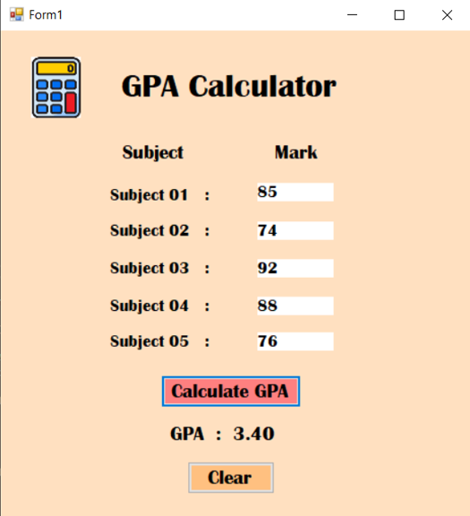

# 🎓 GPA Calculator - C# Windows Forms (OOP Project)

A simple yet functional GPA Calculator built using C# and Windows Forms, demonstrating Object-Oriented Programming principles such as <b>Encapsulation</b> and <b>Polymorphism (Method Overloading)</b>.

## 🛠️ Technologies Used

- C#
- Windows Forms (.NET Framework)
- Visual Studio

## 📌 Features

- GUI-based GPA Calculator
- Method Overloading used to handle GPA Calculations
- Dynamic input handling
- Clear and user-friendly interface
- In-memory logic (no external database required)

## 🖼️ UI Preview

> The application includes:
- A form with input fields for grades
- Buttons for calculating GPA, clearing data, and exiting
- GPA result display

 
